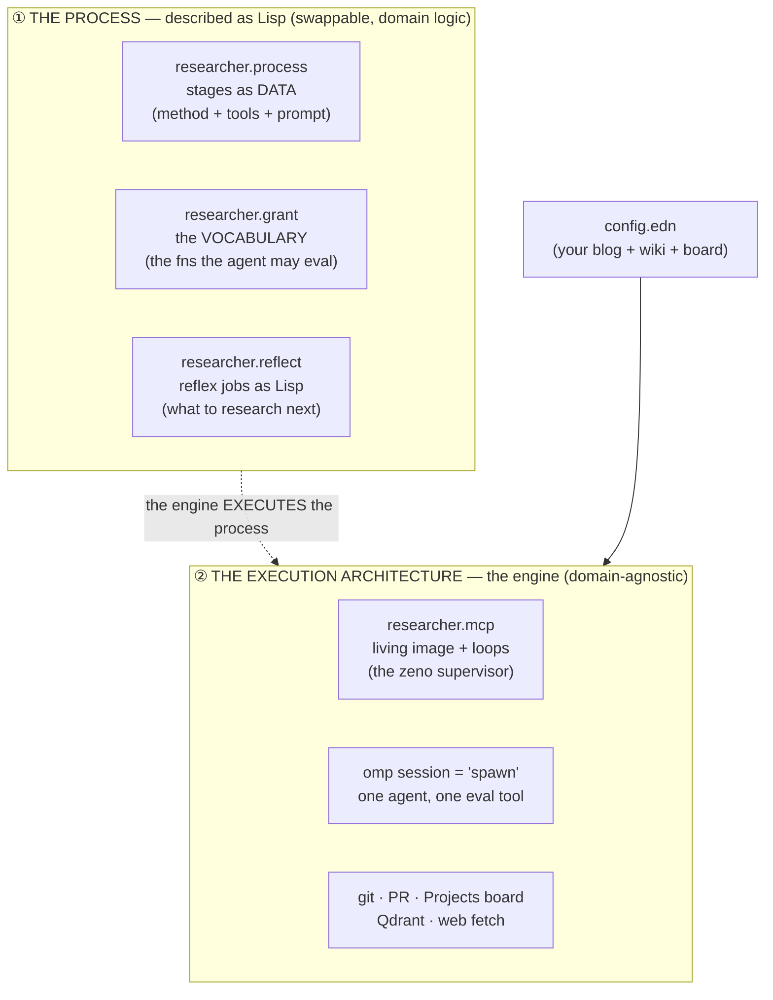
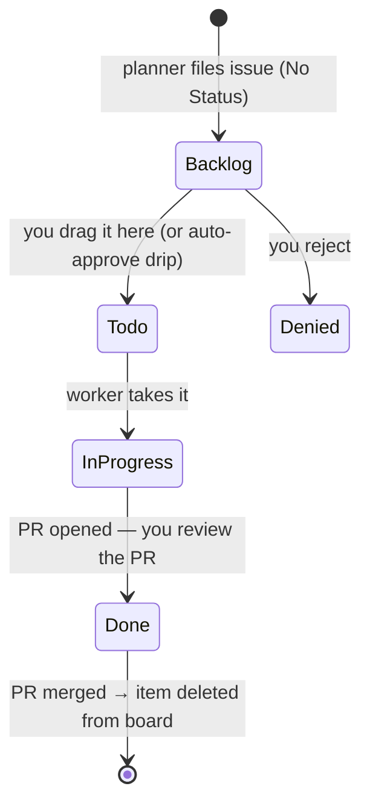
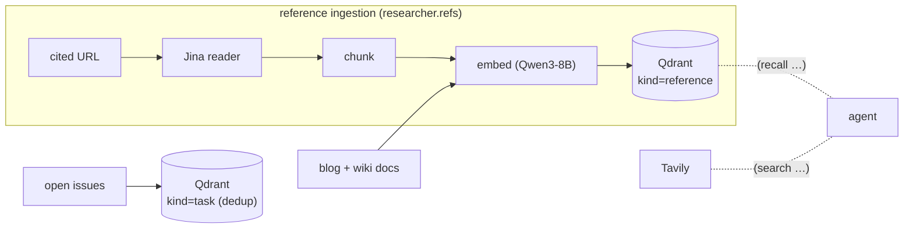

# How Meno works

**Meno is a universal, self-hostable auto-researcher.** You point it at *your* notes
(any blog/git repo) and *your* wiki repo; it grows a densely `[[wikilinked]]`
Zettelkasten research wiki from your notes — entirely by AI, versioned in git,
published by [Quartz](https://quartz.jzhao.xyz). **[smith.wiki](https://smith.wiki) is
one instance** — Andy Smith's public deployment, reading
[andysmith.ai](https://andysmith.ai). Every source and output below is config; run
Meno on your own notes and you get your own wiki. Examples use smith.wiki because it's
the reference deployment.

> **The name.** After Plato's *Meno* — learning as *anamnesis*, drawing out knowledge
> already latent in you. Meno doesn't write your blog (that stays your hand-written
> thinking); it *researches* it — generalizes each note up to known theories, re-reads
> the notes through those theories, and files what's missing. The code repo is `meno`;
> its implementation namespaces are `researcher.*`.

---

## The core idea: two decoupled layers (the "zeno" split)

Most agent systems fuse *what to do* into *how it runs* — the research method is baked
into prompts and glue code. Meno keeps them apart, and that separation is the whole
design:



- **① The process** is *what to do*, written as **Lisp — data plus a granted
  vocabulary**. The research method (stages, methods, the card contract) is a Clojure
  data structure; the agent's entire interface is *evaluating* Clojure against a
  granted set of functions. You can rewrite the process without touching the engine.
- **② The execution architecture** is *how it runs*: an always-on "living image" that
  supervises loops, **spawns `omp` agent sessions**, routes their one `eval` tool to a
  capability-scoped image, and checkpoints everything through **git / PRs / a kanban
  board**. This engine is domain-agnostic — it executes whatever ① defines, for
  whatever notes ↔ wiki `config.edn` names.

Swap the config → a different person's wiki. Swap the process Lisp → a different kind
of researcher. Same engine.

---

# ① The process — as Lisp

## Stages are data, not prompts-in-code

`researcher.process` holds the research process as a plain map: `role → stage spec`.
A spec is a named method + the vocabulary that stage may use + its instruction prompt.

```clojure
;; researcher.process/stages  (excerpt) — add/replace a stage here; NO engine change.
{:curate {:stage    "PLAN"
          :practice "FINER-selected + PCC-scoped question, Strong-Inference
                     competing hypotheses, PRISMA-P survey protocol"
          :writes?  false
          :tools    ["recall" "search" "fetch" "central" "submit-plan!"]
          :system   curate-system}   ; the inline instruction prompt
 :research { … :stage "INVESTIGATE" … :tools [… "put-concept!"] }
 :report  { … :stage "RESEARCH"    … :tools [… "put-research!"] }
 :ingest  { … :stage "READ"        … :tools [… "put-reference!"] }}
```

Each stage names an offline research method — the doc's "how it's usually done" canon,
made executable:

| Role | Stage | Named method | Writes | Output card |
|---|---|---|---|---|
| `:ingest` | **READ** | Adler analytical reading + Zettelkasten *literature note* | ✓ | reference |
| `:research` | **INVESTIGATE** | inquiry + syntopical reading + STORM/PRISMA + Toulmin → *permanent note* | ✓ | concept |
| `:report` | **RESEARCH** | full cycle: framing + cited survey + Toulmin findings, long-form | ✓ | research |
| `:curate` | **PLAN** | FINER + PICO/PCC scoping, Strong Inference (Platt 1964), PRISMA-P | ✗ | (files a task) |

## The vocabulary — the agent's only interface is `eval`

The agent has **no tool menu**. Its single capability is `(eval …)` against a
**deny-by-default image** (`researcher.grant`, built on
[SCI](https://github.com/babashka/sci)): only the functions granted to its role exist;
nothing else — no filesystem, no shell, no network — is callable. The process is
*written in this vocabulary*, and the agent thinks by evaluating it:

```clojure
;; the PLAN stage's whole world, reachable through the one eval tool:
(context)                       ; => your role + branch
(tools)                         ; => the fns you may call, with one-line docs
(recall "reproducible builds")  ; kNN over the corpus + existing cards
(search "…")  (fetch url)  (central 12)  (reference-frequency)  (open-tasks)
(submit-plan! {:n 3 :proposal "…"})   ; pick open question #3, submit, end the run
```

The full vocabulary (granted per role): reads — `recall` `search` `fetch` `central`
`reference-frequency` `open-tasks`; writes — `put-concept!` `put-connection!`
`put-answer!` `put-research!` `put-reference!`; planning — `submit-plan!`
`enrich-task!`; self-check — `check-zettel` (a recursive Zettelkasten critic over a
draft card). Adding or removing a capability is a **code edit to the grant**, not
prompt engineering — that's the capability-security boundary.

## The card contract

The wiki is an atomic Zettelkasten: short, single-idea cards that link generously.
`researcher.wiki/render` is the publish layer (frontmatter + body + `## Sources`); the
agent supplies only content.

| Card type | What it is |
|---|---|
| **concept** | canonical short definition of one idea |
| **connection** | a bridge between ideas the notes don't state |
| **answer** | a claim answering a question, with cited grounds |
| **reference** | a source worth reading; `url`/`author`/`date` in frontmatter |
| **research** | full report: question, why it matters, survey, findings, open sub-questions |

## The reflex jobs — the deterministic part of the process

`researcher.reflect` is the planner's Lisp: it decides *what to research next* from the
shape of the corpus, mostly without an LLM.

- **`ingest-new!`** — newest blog posts not yet ingested → a `READ` task.
- **`materialize-sources!`** — a bare URL cited by ≥ 2 cards with no reference card →
  a `READ` task to ingest that source.
- **`materialize-concepts!`** — a dangling `[[wikilink]]` referenced by ≥ 2 cards → an
  `INVESTIGATE` task (the *dangling-link frontier*).
- **`relink-sources!`** — bare URLs that now have a reference card → rewrite to
  `[[wikilinks]]` (mechanical, straight to `main`).
- **`curate-research!`** — the one LLM planner (PLAN stage): pick the most interesting
  *uncovered open question* (harvested from every card's `## Open questions`), draft a
  grounded proposal, file a `RESEARCH` task.
- **`candidates` + `top-up!`** — rank all fileable work (concepts + sources) by
  *incoming references* and fill the queue up to a hard cap.

`researcher.graph` gives this its sense of "what's missing": it parses the wiki into a
graph (nodes = pages, edges = `[[wikilinks]]` + cited URLs) and exposes `central`
(orientation), `dangling` (the concept queue), `reference-frequency` (the source
queue).

---

# ② The execution architecture — the engine

The engine is domain-agnostic. It knows how to spawn agents, evaluate their Lisp under
a capability grant, and checkpoint results through git — nothing about *research*.

## The living image (the zeno supervisor)

`researcher.mcp` is one always-on JVM process that owns all state, secrets, and
privilege. It exposes an MCP gateway over HTTP (`/mcp/<role>`), an embedded nREPL, and
a stdin REPL. Its minimal supervisory shape — an eternal `input → handle → record`
loop of redefinable steps, restartable from a git checkpoint — is the "zeno" core
(`researcher.loop`). It runs four background loops:

| Loop | Cadence | What it does |
|---|---|---|
| **orchestrator** | 15s | poll the board; run the next approved (`Todo`) issue, 1 at a time |
| **reflect** | 1h | `ingest-new!` + `reconcile!` (materialize + relink + changelog) |
| **push-watch** | 20s | on any push to `main` (a merged PR) → `reconcile!` immediately |
| **promote** | 30m | auto-approve: drip one Backlog card → Todo, only when idle |

Config is re-read every tick, so `config.edn` edits apply live; **restarting the
process is how new code is deployed.** Sessions get only the gateway URL — never a
secret.

## "spawn" = an omp session with one eval tool

`researcher.runner/run-issue` is the engine's unit of work. It spawns an `omp`
subprocess (the `spawn`/`agent` primitive) whose only tool is the MCP `eval` at
`/mcp/<role>`:

```mermaid
sequenceDiagram
  participant O as orchestrator loop
  participant R as run-issue (engine)
  participant B as Projects board
  participant A as omp agent (spawn)
  participant G as gateway /mcp/&lt;role&gt; (grant)
  participant H as git / GitHub

  O->>R: next approved (Todo) issue
  R->>B: set "In Progress"
  R->>H: prepare per-issue branch from origin/main
  R->>A: spawn omp (role's system-prompt = the stage)
  loop until done (live status comment every 8s)
    A->>G: eval "(recall …)" / "(fetch …)" / "(put-concept! …)"
    G-->>A: results — only GRANTED symbols exist
  end
  A-->>R: card committed to the branch
  R->>H: force-push branch → open PR (closes #issue) → auto-merge
  R->>B: delete board item (merged)
```

## git · PR · board — the checkpoint & human-triage plumbing

- **Issues are the task queue.** The planner files them; a **GitHub Projects v2 board**
  (`researcher.projects`) is the human↔agent bus.
- **Writes are git.** Every card is a commit on an ephemeral per-issue branch → a PR
  that closes the issue → a merge to `main`. `main` is reached only via a merged PR
  (or the mechanical relink/changelog jobs). The wiki *is* its own audit log; any
  change is revertible by reverting its PR (tracked in `content/changelog.md` with
  merge SHAs).
- **Branch- and profile-scoped grant.** A planner run can't write; a worker run can
  only write its own branch.

### The board lifecycle



Approval = dragging a card to **Todo** (the only human step). On merge the item is
**deleted from the board** (the closed issue + PR + changelog keep the record) so the
board stays the size of the live queue.

## Engine services: retrieval, web, budget

The vocabulary's read fns are backed by engine services:



- **Dense retrieval** (`researcher.index`, Qdrant + Qwen3-Embedding-8B via OpenRouter):
  the whole corpus is embedded; `(recall …)` is kNN for context and dedup. Open issues
  are embedded as `kind=task` so the planner doesn't file duplicates.
- **Reference ingestion** (`researcher.refs`): cited URLs → Jina reader → chunk →
  embed → Qdrant `kind=reference`, so the corpus includes the *sources*.
- **Web**: Tavily (`search`) returns URLs; Jina (`fetch`) returns readable text.
- **Budget** (`researcher.budget`): a per-run token/USD meter with hard caps.

## Security & isolation

- Secrets and privilege live in the image; a session holds only the gateway URL.
- Deny-by-default SCI grant; no ambient filesystem/shell/network.
- **Two GitHub tokens** (see [`auth.md`](./auth.md)): a bot PAT for issues/PRs, a
  separate classic `project`-scope PAT for the board — so the broad classic token
  can't touch code. Wiki pushes use the human's SSH key, not the bot PAT.
- **microsandbox (deferred).** `researcher.sandbox` renders the real `msb run` microVM
  invocation for a worker — egress allowlist + network-bound secrets (`--secret
  ENV@HOST`, never on VM disk) so a malicious fetched page can't exfiltrate the token.
  **Today the worker runs as trusted host code in the living image**; the microVM is
  dry-run scaffold until omp is wired into it.

---

## Running your own instance

Meno is generic — the reference config (smith.wiki) is just one filling-in of:

```clojure
;; config.edn (excerpt)
{:blog {:root "~/your-notes"        :url "https://your-notes.example"}
 :wiki {:root "~/your-wiki-repo"    :site "https://your.wiki" :base "main"}
 :github   {:repo "you/your-wiki"   :token-env "GH_TOKEN"}
 :projects {:owner "you" :name "your-board" …}}   ; the approval board
```

```sh
nix develop                         # clojure + jdk + secretspec
secretspec run -- clojure -M:mcp    # start the living image
clojure -M:test                     # deterministic tests (no network)
```

Point `:blog` at your notes and `:wiki`/`:github`/`:projects` at your output repo and
board, provide the secrets ([`secretspec.toml`](../secretspec.toml)), and you get your
own auto-grown research wiki.

---

## How this is usually done (prior art)

Automated "research → article/report" systems share a skeleton: **plan/perspectives →
retrieve → synthesize → refine → cite.**

| System | Shape |
|---|---|
| **STORM / Co-STORM** (Stanford OVAL) | Wikipedia-style articles: perspective-guided question asking + simulated expert conversations → outline → cited writing. Co-STORM adds human-in-the-loop discourse + a live mind map. |
| **GPT-Researcher** | `planner → parallel executors → publisher`; sub-questions crawled in parallel into a cited report; "deep research" recurses. |
| **AutoSurvey / PaperQA2 / WikiCrow** | Automated literature surveys: retrieval-augmented, multi-stage, iterative refinement, citation-tracing. |
| **Digital gardens / Zettelkasten** | Luhmann's atomic, densely linked notes — the tradition Quartz was built to publish. |

### What's different about Meno

- **The process is swappable Lisp, decoupled from the engine.** Most systems bake the
  method into prompts/glue; here ① (process) and ② (engine) are separate layers — the
  agent literally operates by evaluating a granted vocabulary.
- **Universal & self-hostable.** Not one product wiki — a generic engine anyone runs on
  their own notes. smith.wiki is just the reference instance.
- **Single-author, public-only corpus.** It researches *your public notes*, not the
  open web at large — privacy by construction.
- **git + PR is the write protocol.** Reviewable, revertible commits with a changelog —
  the wiki is its own audit log; a kanban board is the human bus.
- **One granted `eval`, capability-secured.** No tool menu; adding a capability is a
  code edit to the grant. Always-on, self-maintaining, local-first.

---

## Code map

**① Process layer (the Lisp):**

| Namespace | Responsibility |
|---|---|
| `researcher.process` | Stages as data: methods, prompts, the card contract. |
| `researcher.grant` | The granted vocabulary (deny-by-default) the agent evals. |
| `researcher.reflect` | Reflex/planner jobs: ingest-new, materialize, relink, curate, candidates. |
| `researcher.graph` | The wiki knowledge graph — central / dangling / reference-frequency. |
| `researcher.wiki` | `render` a card; bind a writer to a branch. |

**② Engine (the runtime):**

| Namespace | Responsibility |
|---|---|
| `researcher.mcp` | The living image: gateway, nREPL, REPL, the four loops. |
| `researcher.loop` | The minimal supervised step loop (the zeno core). |
| `researcher.runner` | `run-issue`: spawn omp, stream status, push branch, open+merge PR. |
| `researcher.projects` / `.github` | Projects board (GraphQL); issues/PRs/merge (REST). |
| `researcher.index` / `.corpus` | Dense retrieval (Qdrant); corpus docs. |
| `researcher.refs` / `.reader` / `.chunk` / `.embed` / `.qdrant` | Reference-ingestion pipeline. |
| `researcher.search` / `.linkwarden` / `.http` | Web search; reference store; JSON HTTP. |
| `researcher.budget` / `.note` / `.git` | Spend meter; blog parser; per-`publish:`-commit delta. |
| `researcher.bench` / `.sandbox` / `.main` / `.diag` / `.llm` | Model bench; microVM (dry-run); CLI; diagnostics; LLM dry-run sink. |
| `researcher.config` | `load-config` (+ `RESEARCHER_*` env overrides). |
