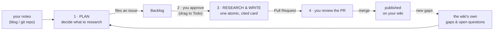
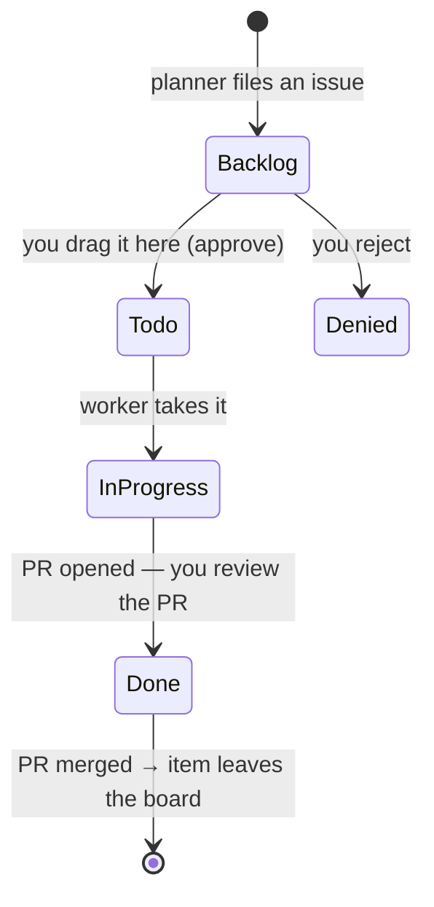

# Meno — the research process

**Meno is a universal, self-hostable auto-researcher.** You point it at *your* notes
(any blog/git repo); it grows a densely `[[wikilinked]]` Zettelkasten research wiki
from them — entirely by AI, versioned in git, published by
[Quartz](https://quartz.jzhao.xyz). **[smith.wiki](https://smith.wiki) is one
instance** — Andy Smith's public deployment, reading
[andysmith.ai](https://andysmith.ai). Run Meno on your own notes and you get your own
wiki; the examples here use smith.wiki because it's the reference deployment.

> **The name.** After Plato's *Meno* — learning as *anamnesis*, drawing out knowledge
> already latent in you. Meno doesn't write your blog (that stays your hand-written
> thinking); it *researches* it — generalizes each note up to known theories, re-reads
> the notes through those theories, and files what's missing.

This document is **the process**: what Meno reads, how it decides what to research, how
*you* approve work, how a page gets written and reviewed, and the methods behind it.
(How the agent is actually executed — the runtime — is a separate concern, parked in
[`zeno.md`](./zeno.md).)

---

## The process at a glance



Four steps, with **you** as the single approval gate in the middle:

1. **Plan** — Meno decides *what to research* and files each unit of work as an issue.
2. **Approve** — you drag a card to **Todo** (the only required human step).
3. **Research & write** — an autonomous worker researches the task and writes one
   atomic, cited card.
4. **Review** — it opens a Pull Request that closes the issue; you review and merge;
   the wiki rebuilds.

Everything is public-in / public-out and recorded in git, so the whole thing is
auditable and revertible.

---

## 1 · Sources — what Meno reads

- **Your notes.** The blog/git repo you configure (`:blog`). Ingest is per published
  post; nothing private is ever touched — Meno only ever sees public notes, so nothing
  private can leak.
- **The wiki itself.** Its existing cards and the links between them are a knowledge
  graph Meno reads to orient and to find gaps.
- **The web**, but only to *ground* a claim: fetch a cited page, search for prior art.
  Sources it relies on become **reference cards** and are added to Meno's searchable
  corpus, so later research can recall them.

---

## 2 · Deciding what to research (planning)

Meno files work from the *shape* of your corpus, mostly by deterministic rules (one
LLM planner for the hard choice):

- **New posts.** A newly published note → a task to *read* it (a literature note).
- **Recurring sources.** A URL cited by **≥ 2** cards, with no reference card yet →
  a task to read and ingest that source.
- **The dangling-link frontier.** A `[[wikilink]]` that ≥ 2 cards point to but that
  doesn't exist yet → a task to write that concept. The wiki tells Meno what it's
  missing.
- **The open-question frontier.** Every card ends with `## Open questions`. The one
  LLM planner picks the single most *interesting, uncovered* question, drafts a
  grounded research proposal, and files it.

All candidate work is ranked by **incoming references** (how many cards link a concept
/ cite a source), so a widely-cited source outranks a concept mentioned twice. Hard
caps keep the queue small and reviewable — at most **50 open** issues, **one new per
tick** — so the Backlog never runs away from you.

Each unit of work is a **GitHub issue**; the issue body states the question, the
method that will handle it, and the cards it touches, so you can judge it before
approving.

---

## 3 · Approving work — the board (your step)

The approval queue is a **GitHub Projects board** — a familiar kanban that doubles as
the human↔agent bus:



- **Backlog** — the planner's output accumulates here, unapproved.
- **Todo** — **approving = dragging a card here.** That's the signal to work it.
  (Optional auto-approve can drip the single *hottest* Backlog card into Todo when the
  board is idle, so it can run unattended.)
- **In Progress / Done** — the worker sets these; when it opens a PR you review the
  **PR**, not the board.
- On merge, the card **leaves the board** (the closed issue + PR + changelog keep the
  full record), so the board only ever shows the live queue.

You stay in control at two points: which issues become **Todo**, and which **PRs**
merge.

---

## 4 · Researching & writing — the stages

Each task carries a **stage**: a named, best-practice research method (not an ad-hoc
prompt). This is where the quality bar is made explicit — every stage is grounded in
an established method from the reading/research canon:

| Stage | What it does | Method | Output |
|---|---|---|---|
| **READ** | read one source, take a literature note | Adler *analytical reading* + Zettelkasten | a **reference** card |
| **INVESTIGATE** | define one concept from the notes + sources | inquiry + *syntopical reading* + STORM/PRISMA + Toulmin | a **concept** card |
| **RESEARCH** | full cited write-up of one open question | framing + syntopical survey + Toulmin findings | a **research** card |
| **PLAN** | pick & scope the next question (no writing) | FINER + PICO/PCC scoping, Strong Inference (Platt 1964), PRISMA-P | a filed task |

For an approved task, an autonomous worker executes that stage: it **recalls** related
cards and sources from the corpus, **searches/fetches** the web to ground claims,
drafts one **atomic** card, and runs it through a **Zettelkasten self-critic** (checks
it's single-idea, densely linked, and cited) before writing.

### The card contract

The wiki is an atomic Zettelkasten — short, single-idea cards that link generously:

| Card type | What it is |
|---|---|
| **concept** | canonical short definition of one idea |
| **connection** | a bridge between ideas your notes don't state |
| **answer** | a claim answering a question, with cited grounds |
| **reference** | a source worth reading; its URL/author/date sit in the page metadata |
| **research** | a full report: question, why it matters, survey, findings, open sub-questions |

Every card links related cards with `[[wikilinks]]` and lists its sources, so the wiki
becomes a navigable graph, not a pile of pages.

---

## 5 · Review & publish

- The worker commits the card to its own branch and opens a **Pull Request that closes
  the issue**. You review the diff (or let it auto-merge if you're running unattended).
- On merge to `main`, Quartz rebuilds and **publishes** to your wiki.
- Every change is a reviewable, **revertible** commit; a `changelog` page records each
  merged PR with its links and merge SHA, so any page can be rolled back by reverting
  its PR. **The wiki is its own audit log.**
- Immediately after a merge, Meno does light housekeeping: rewrite any now-resolvable
  bare URLs into `[[wikilinks]]`, and update the changelog.

---

## How this is usually done (prior art)

Automated "research → article" systems share a skeleton: **plan/perspectives →
retrieve → synthesize → refine → cite.**

| System | Shape |
|---|---|
| **STORM / Co-STORM** (Stanford OVAL) | Wikipedia-style articles: perspective-guided question asking + simulated expert conversations → outline → cited writing. Co-STORM adds a human in the loop + a live mind map. |
| **GPT-Researcher** | planner → parallel executors → publisher; sub-questions crawled into a cited report; "deep research" recurses. |
| **AutoSurvey / PaperQA2 / WikiCrow** | automated literature surveys: retrieval-augmented, multi-stage, iterative refinement, citation-tracing. |
| **Digital gardens / Zettelkasten** | Luhmann's atomic, densely linked notes — the tradition Quartz was built to publish. |

**What's different about Meno:**

- **The method is explicit and named** — each stage is an executable version of a
  real research practice (Adler, Zettelkasten, Toulmin, PRISMA, Strong Inference,
  FINER/PCC), not a hidden prompt.
- **Single-author, public-only corpus** — it researches *your public notes*, not the
  open web at large. Privacy by construction.
- **git + PR is the review protocol** — every change is a reviewable, revertible
  commit with a changelog; a kanban board is the human approval bus.
- **Universal & self-hostable** — a generic engine anyone runs on their own notes;
  smith.wiki is just the reference instance.

---

## Run your own instance

The reference config (smith.wiki) is one filling-in of:

```clojure
;; config.edn (excerpt)
{:blog {:root "~/your-notes"     :url "https://your-notes.example"}
 :wiki {:root "~/your-wiki-repo" :site "https://your.wiki" :base "main"}
 :github   {:repo "you/your-wiki"  :token-env "GH_TOKEN"}
 :projects {:owner "you" :name "your-board" …}}   ; the approval board
```

```sh
nix develop                         # clojure + jdk + secretspec
secretspec run -- clojure -M:mcp    # start Meno
clojure -M:test                     # deterministic tests (no network)
```

Point `:blog` at your notes and `:wiki`/`:github`/`:projects` at your output repo and
board, provide the secrets ([`secretspec.toml`](../secretspec.toml)), and you get your
own auto-grown research wiki.

The runtime that actually executes all this — the always-on engine, how agents are
spawned and sandboxed — is documented separately in [`zeno.md`](./zeno.md).
