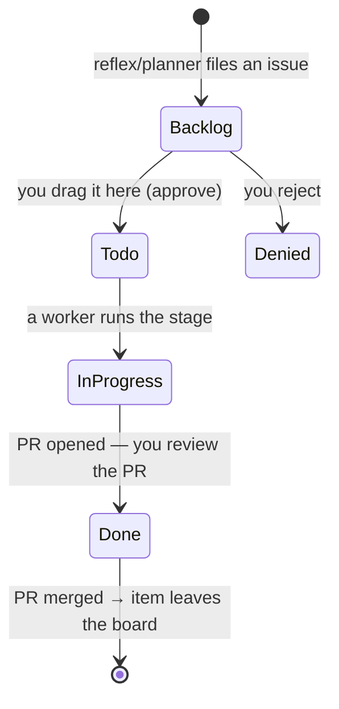

# Meno — the research process, in code

**Meno is a universal, self-hostable auto-researcher.** You point it at *your* notes;
it grows a densely `[[wikilinked]]` Zettelkasten research wiki from them.
**[smith.wiki](https://smith.wiki)** is one instance (Andy Smith's public deployment,
reading [andysmith.ai](https://andysmith.ai)).

> Named after Plato's *Meno* — learning as *anamnesis*, drawing out knowledge already
> latent in you.

This document maps the **research domain onto the Clojure**: the stages, the methods,
the agent's vocabulary, the card contract, and the rules that decide what to research
next — each shown as the actual code. (How the agent is *executed* — the always-on
runtime — is a separate concern, in [`zeno.md`](./zeno.md).)

Everything here lives in ~5 small namespaces: `researcher.process` (stages),
`researcher.grant` (vocabulary), `researcher.reflect` (what-next), `researcher.wiki`
(card contract), `researcher.graph` (the frontier).

---

## 1 · The process is data: `researcher.process/stages`

The whole research method is a map — `role → stage spec`. A spec is a named research
practice, the vocabulary that stage may call, whether it writes, its model, and its
instruction prompt. **Add or change a stage here and nothing else moves.**

```clojure
(def stages
  {:ingest                                             ; READ a source
   {:stage "READ"
    :practice "Adler analytical reading + Zettelkasten literature note"
    :writes? true
    :tools   ["recall" "fetch" "open-tasks" "enrich-task!" "put-reference!"]
    :model   "opencode-go/deepseek-v4-flash"
    :system  read-system}

   :research                                           ; INVESTIGATE one concept
   {:stage "INVESTIGATE"
    :practice "scientific inquiry + syntopical reading + STORM/PRISMA + Toulmin + Zettelkasten permanent note"
    :writes? true
    :tools   ["recall" "search" "fetch" "central" "reference-frequency" "open-tasks"
              "check-zettel" "put-concept!"]
    :system  investigate-system}

   :report                                             ; RESEARCH — full cited write-up
   {:stage "RESEARCH"
    :practice "full research cycle — framing + syntopical reading + STORM/PRISMA cited survey + Toulmin findings, written as one long-form report"
    :writes? true
    :tools   ["recall" "search" "fetch" "central" "reference-frequency" "open-tasks"
              "check-zettel" "put-research!"]
    :system  research-system}

   :curate                                             ; PLAN — scope the next question
   {:stage "PLAN"
    :practice "FINER-selected + PCC-scoped question, Strong-Inference competing hypotheses, PRISMA-P survey protocol"
    :writes? false
    :tools   ["recall" "search" "fetch" "central" "reference-frequency" "open-tasks" "submit-plan!"]
    :system  curate-system}})
```

The bridge from a role to what actually runs is three tiny functions — a stage's
prompt is `base` (the rules of the game) + its inline `:system`:

```clojure
(defn roles  [] (keys stages))
(defn spec   [role] (get stages (keyword role)))
(defn system-prompt [role]
  (str base "\n\n---\n\n" (:system (spec role))))       ; base + the stage's method
(defn practice-ref  [role]                              ; the human-readable line on the issue
  (let [{:keys [stage practice]} (spec role)]
    (str "- Stage: " stage " — " practice)))
```

| Role | Stage | Named method (the practice) | Writes | Output card |
|---|---|---|---|---|
| `:ingest` | READ | Adler analytical reading + Zettelkasten literature note | ✓ | reference |
| `:research` | INVESTIGATE | inquiry + syntopical reading + STORM/PRISMA + Toulmin | ✓ | concept |
| `:report` | RESEARCH | framing + cited survey + Toulmin findings, long-form | ✓ | research |
| `:curate` | PLAN | FINER + PICO/PCC scoping, Strong Inference, PRISMA-P | ✗ | (files a task) |

---

## 2 · A stage *is* a method, written out

The `:system` strings are the domain methodology, named inline. **READ** encodes
Adler's analytical reading + the Zettelkasten literature-note step, plus the rule that
frontier work is *left as links*, not filed by hand:

```clojure
(def read-system
  (str "STAGE: READ.  PRACTICE: Adler's analytical reading + the Zettelkasten literature-note step.\n\n"
       "Your input is a task naming a SOURCE — a URL … FIRST `(fetch <url>)` … then read it analytically.\n\n"
       "STEP 1 — WRITE THE REFERENCE CARD (put-reference!):\n"
       "  (put-reference! {:title … :url … :body \"<compact Markdown, a reading note NOT a rewrite:\n"
       "       ## Summary … ## Key ideas … ## Conclusions … ## Open questions …\n"
       "     Weave the KEY CONCEPTS as [[Canonical name|short form]] wikilinks (dangling = the frontier).\">})\n\n"
       "STEP 2 — FILE THE FRONTIER (dedup FIRST):\n"
       "- Leave a [[Canonical name]] wikilink for every CONCEPT … Do NOT file concept tasks: a periodic "
       "job promotes a concept once several cards link it.\n"
       "- Leave every unresolved QUESTION in `## Open questions` … a periodic job curates the most "
       "interesting into a research task.\n"
       "- Any OTHER source cited → keep as a bare URL in ## Sources … a periodic job promotes it once it recurs.\n\n"
       "DEDUP: (recall <x> 8) finds existing cards AND open tasks … If a card exists, skip UNLESS this "
       "source materially corrects/extends it. … Then stop."))
```

*(Excerpted — the real string is fuller, but this is verbatim in shape.)* The whole
domain rule "recurrence promotes work to the queue" is right here: the agent only
*leaves* `[[wikilinks]]`, bare URLs, and `## Open questions`; the reflex jobs (§4) turn
recurrence into tasks.

**PLAN** encodes the research-lead's method — the proposal it must produce is a
protocol with named sections:

```clojure
(def curate-system
  (str "STAGE: PLAN.  PRACTICE: research-lead planning grounded in named methods — FINER question "
       "selection (Cummings), PCC scoping (Population/Concept/Context, JBI), Strong Inference "
       "(Platt 1964: multiple competing hypotheses + crucial tests), and a PRISMA-P-style survey protocol. …\n"
       "1. SELECT the single best question by FINER: Feasible, Interesting, Novel, Ethical, Relevant …\n"
       "2. (submit-plan! {:n <the number> :proposal \"<Markdown>\"}) once. The proposal sections in order:\n\n"
       "## Why & what for — FINER rationale …\n"
       "## Question (PCC) — Population / Concept / Context …\n"
       "## Hypotheses (Strong Inference) — 2–3 MUTUALLY COMPETING answers + the crucial test that EXCLUDES each …\n"
       "## Plan (PRISMA-P) — the survey protocol drafted BEFORE doing it …"))
```

---

## 3 · The vocabulary the agent thinks in: `researcher.grant`

The agent has **no tool menu.** Its single capability is `(eval …)` against a
deny-by-default image; only the fns granted to its role exist. The vocabulary *is* the
domain's verbs — this map is their contract:

```clojure
(def ^:private tool-docs
  {"recall"  "(recall q [k]) — semantic search across the corpus and existing cards"
   "fetch"   "(fetch url) — readable text of an external web page (also cites it)"
   "search"  "(search q) — web search; returns candidate source URLs"
   "central" "(central n) — the n most-linked pages in the wiki graph"
   "reference-frequency" "(reference-frequency) — most-cited source URLs"
   "open-tasks" "(open-tasks) — [{:number :title}] tasks already queued"
   "submit-plan!"  "(submit-plan! {:n :proposal}) — pick open question #n and submit your research proposal; ends the planning run"
   "enrich-task!"  "(enrich-task! n md) — append a note to an open task"
   "put-concept!"  "(put-concept! {:title :description :tags :body :sources}) — write the canonical concept card"
   "put-connection!" "(put-connection! {:title :tags :body :seed :sources}) — write a connection card"
   "put-answer!"   "(put-answer! {:title :tags :body :seed :sources}) — a claim answering a question, with cited grounds"
   "put-research!" "(put-research! {:title :tags :body :sources}) — the full research report card; long, no length cap"
   "put-reference!" "(put-reference! {:title :url :author :date :kind :tags :body :sources}) — a reference card; :url etc. land in frontmatter"
   "check-zettel"  "(check-zettel {:type :title :body}) — recursively run a Zettelkasten editor over a draft card; returns OK or a list of fixes"})
```

A run only sees the subset in its stage's `:tools` (§1). Adding a capability is a code
edit to the grant, not prompt engineering.

---

## 4 · What to research next: `researcher.reflect`

The planner files work from the *shape* of the corpus — mostly deterministic rules,
one LLM planner for the hard choice. The core domain rule is **recurrence**: a
`[[concept]]` many cards link, or a URL many cards cite, is worth a card.

`candidates` is that rule — one ranked queue across concepts + sources, scored by
**incoming references**:

```clojure
(defn candidates
  "All fileable work as ONE ranked list, scored by INCOMING references … Highest first,
   so a heavily-cited source outranks a rarely-linked concept."
  [cfg dir]
  (let [cthr  (get-in cfg [:reflect :concept-threshold] 2)
        sthr  (get-in cfg [:reflect :ingest-threshold] 2)
        cards (reference-index dir)
        concepts (->> (concept-frequency dir)                 ; dangling [[X]] by link count
                      (keep (fn [[_ {:keys [files title]}]]
                              (when (>= (count files) cthr)
                                {:kind :concept :title (str "Add concept: " title)
                                 :name title :files files :score (count files)}))))
        sources  (->> (source-frequency dir)                  ; bare URLs by citation count
                      (keep (fn [[u files]]
                              (when (and (>= (count files) sthr) (not (contains? cards u)))
                                {:kind :ingest :title (str "Ingest: " u) :url u
                                 :files files :score (count files)}))))]
    (sort-by (comp - :score) (concat concepts sources))))
```

`top-up!` files the top of that queue up to a hard cap, so the Backlog stays small and
reviewable:

```clojure
(defn top-up!
  "Fill the board up to :planner :max-open OPEN issues with the highest-incoming-count
   candidates, skipping anything already carded or queued."
  [cfg]
  (let [dir    (fresh-main! cfg)
        open   (gh/open-issues cfg)
        opent  (set (map #(str (get % "title")) open))
        budget (max 0 (- (get-in cfg [:planner :max-open] 50) (count open)))
        pick   (->> (candidates cfg dir)
                    (remove #(contains? opent (:title %)))
                    (take budget))]
    (vec (for [c pick] …))))                             ; file-concept-task! / file-ingest-task!
```

New posts get their own puller; the open-question frontier gets the one LLM planner:

```clojure
(defn ingest-new!            ; newest published posts with no reference card, not queued -> READ tasks
  ([cfg] (ingest-new! cfg (get-in cfg [:reflect :ingest-new-per-run] 5)))
  …)

(defn curate-research!       ; the PLAN planner (run on demand): pick the most interesting UNCOVERED
  "Pick the single most interesting UNCOVERED open question and file it as a fully-planned
   research task. No-op while a research PR is in flight …"
  [cfg & [{:keys [dry?]}]]
  (if (open-research-pr? cfg)
    {:skipped :research-pr-open}
    (let [dir     (fresh-main! cfg)
          qmap    (question-sources dir)                 ; every card's ## Open questions
          covered (into (research-card-titles dir) (research-issue-titles cfg))
          pool    (->> (keys qmap) (remove covered) vec)]
      … (runner/run-issue cfg {:role :curate :title "Research planning"
                               :body (pool-prompt qmap pool)})
      … (file-research-task! cfg q proposal links))))
```

`top-up!`, `relink-sources!` and `rebuild-changelog!` run together as the
merge-driven `reconcile!` suite (on every merge to `main` + hourly); `ingest-new!`
runs on the hourly tick; `curate-research!` is invoked on demand. The runtime that
schedules them is [`zeno.md`](./zeno.md):

```clojure
(defn reconcile!             ; the merge-driven suite, serialized under a lock
  [cfg]
  (locking recon-lock
    {:topup     (safe :top-up    #(top-up! cfg))          ; fill the queue by recurrence
     :relinked  (safe :relink    #(relink-sources! cfg))  ; bare URL that now has a card -> [[wikilink]]
     :changelog (safe :changelog #(rebuild-changelog! cfg))}))
```

The thresholds and caps are all config (`config.edn`) — the domain's tuning knobs:

```clojure
:reflect  {:ingest-threshold 2   ; a bare URL cited in >= N cards -> ingest task
           :concept-threshold 2  ; a dangling [[concept]] linked by >= N cards -> concept task
           :ingest-new-per-run 5}
:planner  {:max-open 50          ; hard cap on total OPEN issues; filers stop here
           :max-new-per-run 1
           :wip-cap 10}
```

**The frontier** those rules read comes from `researcher.graph`, the one place that
parses the wiki into a graph: `central` (most-linked pages, for orientation),
`dangling` (referenced-but-missing links, the concept queue), `reference-frequency`
(most-cited URLs, the source queue).

---

## 5 · The card contract: `researcher.wiki/render`

Cards are atomic and single-idea. `render` is the publish layer — the agent supplies
content, the code lays out frontmatter + body + `## Sources`. Reference bibliographic
fields (`url`/`author`/`date`/`kind`) live in the frontmatter so they can be parsed
back and rendered by Quartz:

```clojure
(defn render
  [{:keys [title type description tags body sources collection-url seed author url date kind]}]
  (let [tags (as-list tags) sources (as-list sources)]
    (str "---\n"
         "title: " title "\n"
         "type: " (name (or type :concept)) "\n"
         (when kind   (str "kind: "   kind   "\n"))
         (when author (str "author: " author "\n"))
         (when url    (str "url: "    url    "\n"))       ; the canonical source
         (when date   (str "date: "   date   "\n"))
         (when description (str "description: " description "\n"))
         (when (seq tags) (str "tags: [" (str/join ", " tags) "]\n"))
         (when seed   (str "seed: " seed "\n"))
         "---\n\n"
         (str/trim (or body "")) "\n"
         (when (and (seq sources) (not (re-find #"(?m)^## Sources" (str body))))
           (str "\n## Sources\n\n" (str/join "\n" (map #(str "- " %) sources)) "\n"))
         (when collection-url (str "\nSaved references: " collection-url "\n")))))
```

| `type` | What it is |
|---|---|
| `concept` | canonical short definition of one idea |
| `connection` | a bridge between ideas your notes don't state |
| `answer` | a claim answering a question, with cited grounds |
| `reference` | a source worth reading; `url`/`author`/`date` in frontmatter |
| `research` | a full report: question, why it matters, survey, findings, open sub-questions |

---

## 6 · The human gates (issue → board → PR)

The process files each unit of work as a **GitHub issue** whose body carries the
question, the `practice-ref` line (§1), and the cards it touches — so you can judge it
before approving. A **GitHub Projects board** is the human step:



Approving = dragging a card to **Todo**. A worker runs that role's stage (§1),
commits one card, and opens a **PR that closes the issue**; you review and merge, and
Quartz publishes. Every change is a reviewable, revertible commit; a `changelog`
records each merged PR with its SHA. The machinery that spawns and sandboxes the
worker is [`zeno.md`](./zeno.md).

---

## How this is usually done (prior art)

Automated "research → article" systems share a skeleton: **plan/perspectives →
retrieve → synthesize → refine → cite** — STORM / Co-STORM (Stanford), GPT-Researcher,
AutoSurvey / PaperQA2 / WikiCrow, and the Zettelkasten / digital-garden tradition.

**What's different about Meno:** the method is *explicit code* — each stage is an
executable version of a named research practice (Adler, Zettelkasten, Toulmin, PRISMA,
Strong Inference, FINER/PCC), not a hidden prompt; it researches a **single author's
public notes** (privacy by construction); **git + PR is the review protocol**; and it's
a **universal, self-hostable** engine (smith.wiki is one instance).

---

## Run your own instance

```clojure
;; config.edn (excerpt)
{:blog {:root "~/your-notes"     :url "https://your-notes.example"}
 :wiki {:root "~/your-wiki-repo" :site "https://your.wiki" :base "main"}
 :github   {:repo "you/your-wiki"  :token-env "GH_TOKEN"}
 :projects {:owner "you" :name "your-board" …}}
```

```sh
nix develop  &&  secretspec run -- clojure -M:mcp     # start Meno
clojure -M:test                                        # deterministic tests
```
