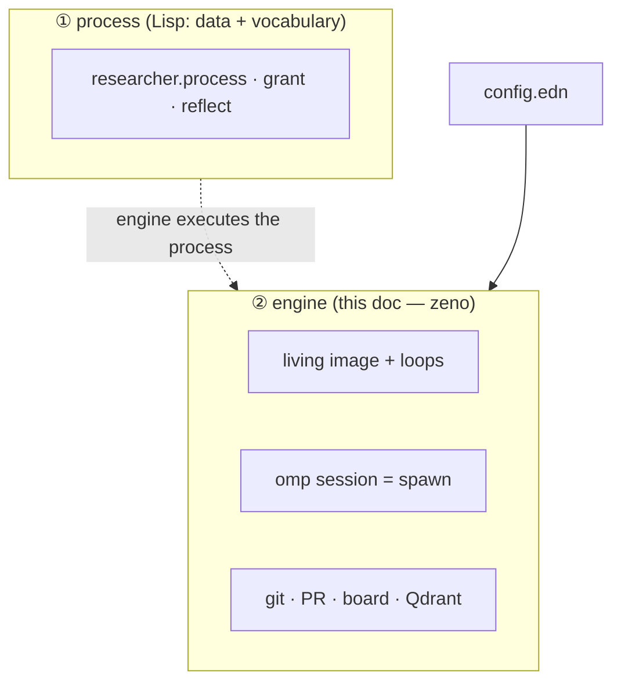
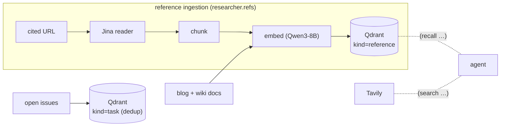

# The execution engine (zeno)

> **Parked.** This describes *how* Meno is run — the always-on runtime that spawns and
> supervises agents. It's a general pattern ("zeno") independent of research, and will
> move into the zeno project's own docs. For **what Meno does** (the research process
> you approve and show), see [`process.md`](./process.md).

Meno separates *what to do* from *how it runs*:

- **The process** — the research method — is data + a granted vocabulary (see
  `process.md` and the code in `researcher.process` / `researcher.grant` /
  `researcher.reflect`). Swappable without touching the engine.
- **The engine (zeno)** — this doc — is domain-agnostic: it knows how to spawn agents,
  evaluate their Lisp under a capability grant, and checkpoint results through git. It
  executes whatever process the ① layer defines, for whatever repos `config.edn` names.



---

## The living image (the supervisor)

`researcher.mcp` is one always-on JVM process that owns all state, secrets, and
privilege. It exposes an MCP gateway over HTTP (`/mcp/<role>`), an embedded nREPL, and
a stdin REPL. Its minimal supervisory shape — an eternal `input → handle → record`
loop of redefinable steps, restartable from a git checkpoint — is the zeno core
(`researcher.loop`). It runs four background loops:

| Loop | Cadence | What it does |
|---|---|---|
| **orchestrator** | 15s | poll the board; run the next approved (`Todo`) issue, 1 at a time |
| **reflect** | 1h | ingest new posts + reconcile (materialize + relink + changelog) |
| **push-watch** | 20s | on any push to `main` (a merged PR) → reconcile immediately |
| **promote** | 30m | auto-approve: drip one Backlog card → Todo, only when idle |

Config is re-read every tick, so `config.edn` edits apply live; **restarting the
process is how new code is deployed.** Sessions get only the gateway URL — never a
secret.

---

## "spawn" = an omp session with one `eval` tool

`researcher.runner/run-issue` is the engine's unit of work. It spawns an `omp`
subprocess (the `spawn` primitive) whose *only* tool is the MCP `eval` at
`/mcp/<role>`:

```mermaid
sequenceDiagram
  participant O as orchestrator loop
  participant R as run-issue (engine)
  participant B as board
  participant A as omp agent (spawn)
  participant G as gateway /mcp/&lt;role&gt; (grant)
  participant H as git / GitHub

  O->>R: next approved (Todo) issue
  R->>B: set "In Progress"
  R->>H: prepare per-issue branch from origin/main
  R->>A: spawn omp (role's system-prompt = the stage)
  loop until done (live status comment every 8s)
    A->>G: eval "(recall …)" / "(fetch …)" / "(put-concept! …)"
    G-->>A: results — only GRANTED symbols exist
  end
  A-->>R: card committed to the branch
  R->>H: force-push branch → open PR (closes #issue) → auto-merge
  R->>B: delete board item (merged)
```

The agent has **no tool menu.** Its single capability is `(eval …)` against a
**deny-by-default image** (`researcher.grant`, built on
[SCI](https://github.com/babashka/sci)): only the functions granted to its role exist
— no filesystem, no shell, no network except through those fns. Adding or removing a
capability is a code edit to the grant, not prompt engineering. This is the
capability-security boundary.

---

## git · PR · board — checkpoint & human bus

- **Issues are the task queue**; a **GitHub Projects v2 board** (`researcher.projects`)
  is the human↔agent bus.
- **Writes are git.** Every card is a commit on an ephemeral per-issue branch → a PR
  that closes the issue → a merge to `main`. `main` is reached only via a merged PR
  (or the mechanical relink/changelog jobs). The wiki *is* its own audit log.
- **Branch- and profile-scoped grant.** A planner run can't write; a worker run can
  only write its own branch.

---

## Engine services: retrieval, web, budget

The process's read vocabulary is backed by engine services:



- **Dense retrieval** (`researcher.index`, Qdrant + Qwen3-Embedding-8B via OpenRouter):
  the corpus is embedded; `(recall …)` is kNN for context and dedup. Open issues are
  embedded as `kind=task` so the planner doesn't file duplicates.
- **Reference ingestion** (`researcher.refs`): cited URLs → Jina reader → chunk →
  embed → Qdrant `kind=reference`.
- **Web**: Tavily (`search`) returns URLs; Jina (`fetch`) returns readable text.
- **Budget** (`researcher.budget`): a per-run token/USD meter with hard caps.

---

## Security & isolation

- Secrets and privilege live in the image; a session holds only the gateway URL.
- Deny-by-default SCI grant; no ambient filesystem/shell/network.
- **Two GitHub tokens** (see [`auth.md`](./auth.md)): a bot PAT for issues/PRs, a
  separate classic `project`-scope PAT for the board — so the broad classic token
  can't touch code. Wiki pushes use the human's SSH key, not the bot PAT.
- **microsandbox (deferred).** `researcher.sandbox` renders the real `msb run` microVM
  invocation for a worker — egress allowlist + network-bound secrets (`--secret
  ENV@HOST`, never on VM disk) so a malicious fetched page can't exfiltrate the token.
  **Today the worker runs as trusted host code in the living image**; the microVM is
  dry-run scaffold until omp is wired into it.

---

## Code map

**① Process layer (the Lisp — see [`process.md`](./process.md)):**

| Namespace | Responsibility |
|---|---|
| `researcher.process` | Stages as data: methods, prompts, the card contract. |
| `researcher.grant` | The granted vocabulary (deny-by-default) the agent evals. |
| `researcher.reflect` | Reflex/planner jobs: ingest-new, materialize, relink, curate, candidates. |
| `researcher.graph` | The wiki knowledge graph — central / dangling / reference-frequency. |
| `researcher.wiki` | `render` a card; bind a writer to a branch. |

**② Engine (this doc):**

| Namespace | Responsibility |
|---|---|
| `researcher.mcp` | The living image: gateway, nREPL, REPL, the four loops. |
| `researcher.loop` | The minimal supervised step loop (the zeno core). |
| `researcher.runner` | `run-issue`: spawn omp, stream status, push branch, open+merge PR. |
| `researcher.projects` / `.github` | Projects board (GraphQL); issues/PRs/merge (REST). |
| `researcher.index` / `.corpus` | Dense retrieval (Qdrant); corpus docs. |
| `researcher.refs` / `.reader` / `.chunk` / `.embed` / `.qdrant` | Reference-ingestion pipeline. |
| `researcher.search` / `.linkwarden` / `.http` | Web search; reference store; JSON HTTP. |
| `researcher.budget` / `.note` / `.git` | Spend meter; blog parser; per-`publish:`-commit delta. |
| `researcher.bench` / `.sandbox` / `.main` / `.diag` / `.llm` | Model bench; microVM (dry-run); CLI; diagnostics; LLM dry-run sink. |
| `researcher.config` | `load-config` (+ `RESEARCHER_*` env overrides). |
